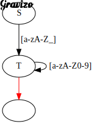
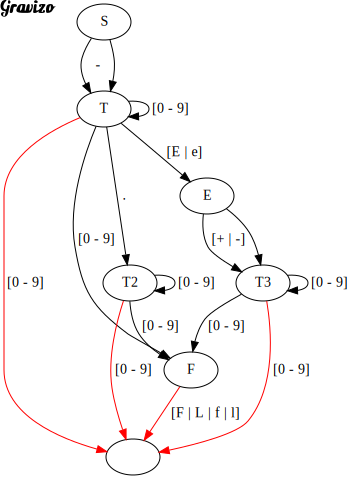

# Теория языков программирования и методы трансляции
## ИС-042 Рябов К.А. & Меньшиков А.О.
## Вариант 6
**Парсер для языка:** Go  
**Язык рантайма:** C++
## Лабораторная работа №1. Формальные языки, грамматики и их свойства
### Задание 1
Дана грамматика. Постройте вывод заданной цепочки.  
1)
```
S : T | T '+' S | T '-' S;
T : F | F '*' T;
F : 'a' | 'b';
```
Цепочка: `a - b * a + b`.  
**Решение:**
```
S => T - S => F - S => a - S =>
=> a - T + S => a - F * T + S => a - b * T + S =>
=> a - b * F + S => a - b * a + S => a - b * a + T =>
=> a - b * a + F => a - b * a + b
```
2)
```
S : 'a' S B C | 'ab' C;
C B : B C;
'b' B : 'bb';
'b' C : 'bc' ;
'c' C : 'cc';
```
Цепочка: `aaabbbccc`.  
**Решение:**
```
S => a S B C => aa S B C B C => aaab C B C B C =>
=> aaab B C C B C => aaabb C C B C => aaabb C B C C =>
=> aaabb B C C C => aaabbb C C C => aaabbbc C C =>
=> aaabbbcc C => aaabbbccc
```
### Задание 2
Построить грамматику, порождающую язык:  
  
a)
```
G ({a, b, c}, {S, T, F}, P, S);
P:
  S => 'a' S | 'a' T;
  T => 'b' T | 'b' F;
  F => 'c' F | 'c';
```
b)
```
G ({0, 1}, {S, T}, P, S);
P:
  S => '0' S | T;
  T => '10' T | ε;
```
c)
```
G ({0, 1}, {S}, P, S);
P:
  S => '0' S '0' | '1' S '1' | '00' | '11';
```
### Задание 3
К какому типу по Хомскому относится грамматика с приведенными правилами? Аргументируйте ответ.  
a)
```
S : '0' A '1' | '01';
'0' A : '00' A '1';
A : '01';
```
**Решение:** Типы 3 и 2 не подходят, т.к. в левой части присутствует терминальный символ. По определению подходит к типу 1 (КЗ грамматика).  
b)
```
S : A 'b';
A : A 'a' | 'ba';
```
**Решение:** В левой части отсутствуют терминальные символы + в правой части терминальные символы стоят после нетерминального, что подходит по определению на леволинейную грамматику.
### Задание 4
Построить КС-грамматику, эквивалентную грамматике с правилами:
```
S : A B | A B S;
A B : B A;
B A : A B;
A : 'a';
B : 'b';
```
**Решение:**
```
L ∈ {ab;ba;abab;abba;baab;baba;aabb;bbaa;...};
G ({a, b}, {S}, P, S);
P:
  S => 'ab' | 'ba' | 'ab' S | 'ba' S | 'a' S 'b' | 'b' S 'a';
```
### Задание 5
Построить регулярную грамматику, эквивалентную грамматике с правилами:
```
S : A '.' A;
A : B | B A;
B : '0' | '1';
```
**Решение:**
```
L ∈ {0.0;0.1;1.0;1.1;00.0;0.00;10.0;11.0;...};
G ({0, 1, .}, {S, T, F}, P, S)
P:
  S => '0' T | '1' T;
  T => '0' T | '1' T | '.' F;
  F => '0' F | '1' F | '0' | '1';
```
### Задание 6
Напишите регулярное выражение для:
1) множества идентификаторов, где идентификатор – это последовательность букв или цифр, начинающаяся с буквы или `_`;
2) множества вещественных констант с плавающей точкой, состоящих из целой части, десятичной точки, дробной части, символа `е` или `Е`, целого показателя степени с необязательным знаком и необязательного суффикса типа – одной из букв `f`, `F`, `l` или `L`. Целая и дробная части состоят из последовательностей цифр. Может отсутствовать либо целая, либо дробная часть (но не обе сразу).  

В качестве ответа приведите:
1) Регулярные выражения;
2) Тестовые данные для проверки;
3) Ссылку на https://regexr.com/ с вашим решением;  

**Решение:** [первое задание](https://regexr.com/78hau), [второе задание](https://regexr.com/78hct)

### Задание 7
Для регулярных выражений из предыдущего задания постройте конечные автоматы. Изобразите их в виде графа. Для встраивания изображения в ответ воспользуйтесь сервисом http://gravizo.com/  

**Решение:**  
1)  
S : '_' T | '[a-zA-Z]' T;  
T : '[a-zA-Z]' T | '[0-9]' T | ε;  
```
 digraph G {
    S -> T [label="[a-zA-Z_]"];

    edge [color=black];
    T -> T [label="[a-zA-Z0-9]"];

    edge [color=red];
    T -> ◉;
  }
```
  
2)  
S : T | '-' T;  
T : [0-9] T | [0-9] | '.' T2 | [0-9] F | 'e' E | 'E' E;  
T2 : [0-9] T2 | [0-9] | [0-9] F;  
E : '+' T3 | '-' T3 | T3;  
T3 : [0-9] T3 | [0-9] | [0-9] F;  
F : 'f' | 'F' | 'l' | 'L';  
```
digraph G {
    S -> T [label="      -"];
    S -> T;

    T -> T [label="[0 - 9]"];
    edge [color=red];
    T -> ◉ [label="[0 - 9]"];
    edge [color=black];
    T -> F [label="[0 - 9]"];
    T -> T2 [label=" ."];
    T -> E [label="[E | e]"];

    T2 -> T2 [label="[0 - 9]"];
    edge [color=red];
    T2 -> ◉ [label="[0 - 9]"];
    edge [color=black];
    T2 -> F [label="[0 - 9]"];

    E -> T3 [label="[+ | -]"];
    E -> T3;

    T3 -> T3 [label="[0 - 9]"];
    edge [color=red];
    T3 -> ◉ [label="[0 - 9]"];
    edge [color=black];
    T3 -> F [label="[0 - 9]"];

    edge [color=red];
    F -> ◉ [label="[F | L | f | l]"];
  }
```

